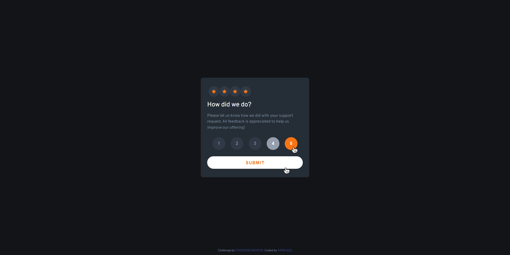
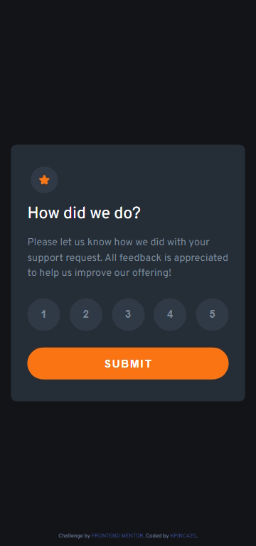
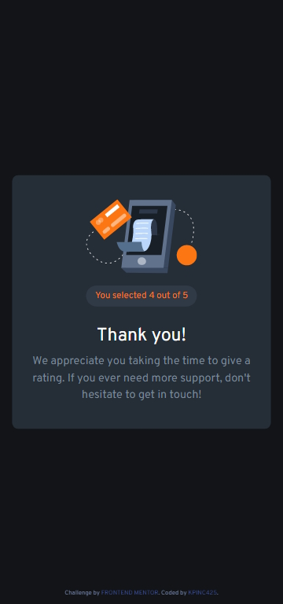

# Frontend Mentor - Interactive rating component solution

This is a solution to the [Interactive rating component challenge on Frontend Mentor](https://www.frontendmentor.io/challenges/interactive-rating-component-koxpeBUmI). Frontend Mentor challenges help you improve your coding skills by building realistic projects. 

## Table of contents

- [Overview](#overview)
  - [The challenge](#the-challenge)
  - [Screenshot](#screenshot)
  - [Links](#links)
- [My process](#my-process)
  - [Built with](#built-with)
  - [What I learned](#what-i-learned)
  - [Continued development](#continued-development)
- [Author](#author)
- [Acknowledgments](#acknowledgments)

## Overview
Used Sass, css modules, vite, and react to build an interactive ratings component, built mobile first.
### The challenge

Users should be able to:

- View the optimal layout for the app depending on their device's screen size
- See hover states for all interactive elements on the page
- Select and submit a number rating
- See the "Thank you" card state after submitting a rating

### Screenshot

  
  

### Links

- Solution URL: [Frontend Mentor](https://your-solution-url.com)
- Live Site URL: [Gethub Pages](https://kpinc425.github.io/FrontEndMentor-InteractiveRating/)

## My process

I wanted to practice a bit more with react and vite, so I decided to use those to build this project. I also wanted to practicea bit more using css modules and sass, so I used those as well. I built the component mobile first as there was much variation from the mobile and desktop version. I used sass with css modules to style the components.  I used react to build the components. I started by building a skeleton with the basic html structure and then starting from the top, built each part that could potentially benefit from it into its own component. I then tackled the confirmation thank you card and finally handled the different states.
### Built with

- HTML5
- CSS custom properties
- CSS Modules
- Flexbox
- Mobile-first workflow
- [Sass](https://sass-lang.com/) - Sass
- [React](https://reactjs.org/) - JS library
- [Vite](https://vitejs.dev/) - Vite

### What I learned

I got a bit more acquainted with the tools I used to build this component. Building a for loop in react seemed a little tricky at first, but I just needed to pull back from the jsx a bit, it was a good refresher. Deploying to github pages was a bit tricky, but I got it working with a little help from the gh-pages npm library and some minor configuration.

### Continued development

For future project I want to experiment with PostCSS or more modern ways to style components. I will continue to use react and vite as I like the speed of vite and the ease of use of react. If challenges get more complex I may text out some of the more advanced react frameworks.

## Author

- Website - [Coming Soon](https://www.your-site.com)
- Frontend Mentor - [@KPInc425](https://www.frontendmentor.io/profile/KPInc425)

## Acknowledgments

GoogleFu
